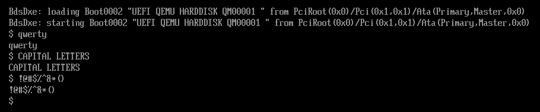

# What is this?
This is a basic UEFI bootloader with a shell that simply echoes back what you type.



# Installation
## Setup
Ensure you are in a linux/WSL envionment.

Also ensure you have the following installed:

- `git`
- `qemu-system-x86_64` (if emulating)
- `edk2-ovmf` (if emulating)
- `make`
- `clang`
## Install
Open a terminal in a preferably empty directory.

Run the following:

```sh
git clone https://github.com/Advaith-Hello/FirstBootloader.git/
cd FirstBootloader/
./setup.sh
make
```
## Running
There are two ways to run this:

- Emulate this with qemu
- Run directly on a computer

To emulate, simply run:

```sh
./run.sh
```

It should open up a window with a shell `$`
## Bare metal
Running on the device directly is more difficult.
**Do not run untrusted code directly without at least reading it**

To do this:

1. Create a preferably empty FAT32 partition on any storage device.
2. Mount the partition in an empty directory.
3. `cp -r disk/* /path/to/your/fat32/partition/`
4. Reboot your computer and load into the boot menu.
5. Ensure your device supports UEFI (if it doesn't, you cant run it).
6. Check your motherboard manual for the above step.
7. Choose the storage device that the partition is in.

